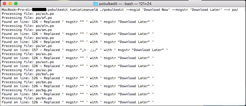

# Pobulkedit
> A simple command-line tool that recoursively updates .po translation files.

Pobulkedit is a simple command-line tool that recoursively updates .po translation files contained in a folder modifying the translation of a specific MessageId that I developed for educational purpose. I was studying GOLang and I decided to create this simple tool as test project for learning how this programming language works.

## Usage example

pobulkedit --msgid 'My Msgid String' --msgstr 'My Msgid translation' myDotPoFileFolder/ --r

## Build

go build pobulkedit.go

## Notes

Made with [Atom Editor](https://atom.io)
